# Customer Management System - Use Case Diagrams

**Version:** 1.1
**Date:** December 2024
**Author:** Product Team

---

## 1. System Overview

### 1.1 Actors

| Actor | Description |
|-------|-------------|
| Customer | Authenticated user with a profile |
| System | Vult backend application |

---

## 2. Use Case Diagrams

### 2.1 Customer Management Use Cases

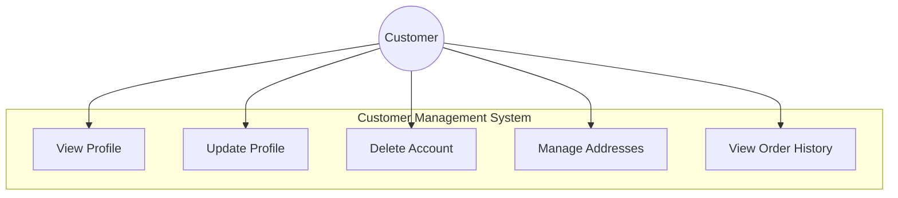

### 2.2 Address Management Use Cases

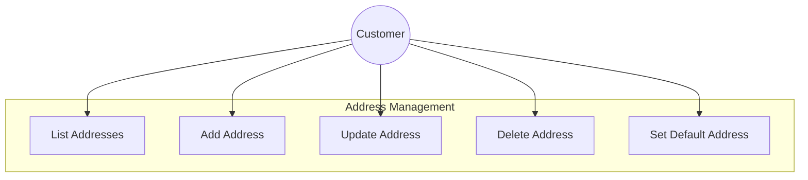

---

## 3. Sequence Diagrams

### 3.1 Profile Update Flow

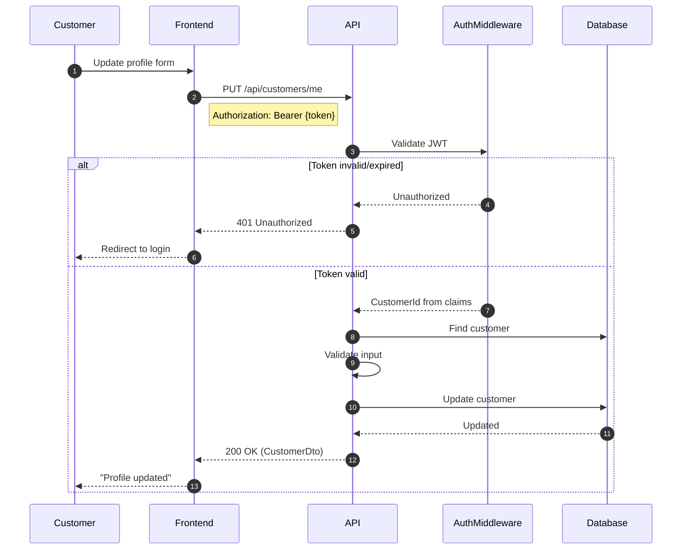

### 3.2 Address Management Flow

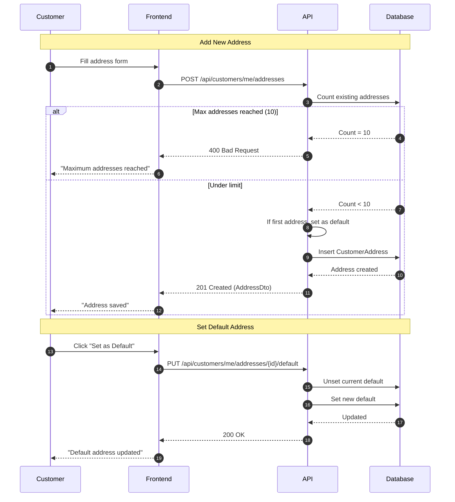

### 3.3 Order History Flow

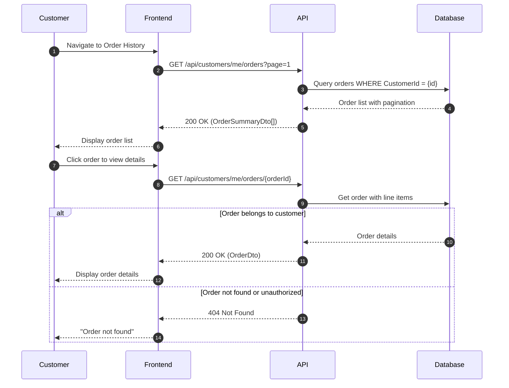

---

## 4. Detailed Use Cases

### 4.1 UC-001: Manage Addresses

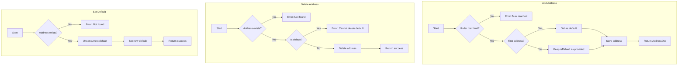

**Use Case Specification:**

| Field | Value |
|-------|-------|
| **Name** | Manage Addresses |
| **ID** | UC-001 |
| **Actors** | Customer |
| **Preconditions** | - Customer authenticated |
| **Postconditions** | - Address changes persisted |
| **Basic Flow (Add)** | 1. Customer provides address details 2. System validates address count 3. System sets default if first 4. System saves address |
| **Alternative Flows** | - Max addresses: Return error - Delete default: Return error |
| **Business Rules** | - Max 10 addresses per customer - First address is default - Cannot delete default address |

---

### 4.2 UC-002: View Order History

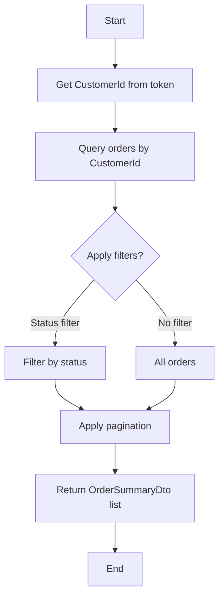

**Use Case Specification:**

| Field | Value |
|-------|-------|
| **Name** | View Order History |
| **ID** | UC-002 |
| **Actors** | Customer |
| **Preconditions** | - Customer authenticated |
| **Postconditions** | - Order list returned |
| **Basic Flow** | 1. Customer requests order history 2. System queries orders by CustomerId 3. System applies pagination 4. System returns order summaries |
| **Alternative Flows** | - No orders: Return empty list |
| **Business Rules** | - Only show customer's own orders - Default sort by date descending |

---

## 5. State Machine Diagrams

### 5.1 Customer Account State Machine

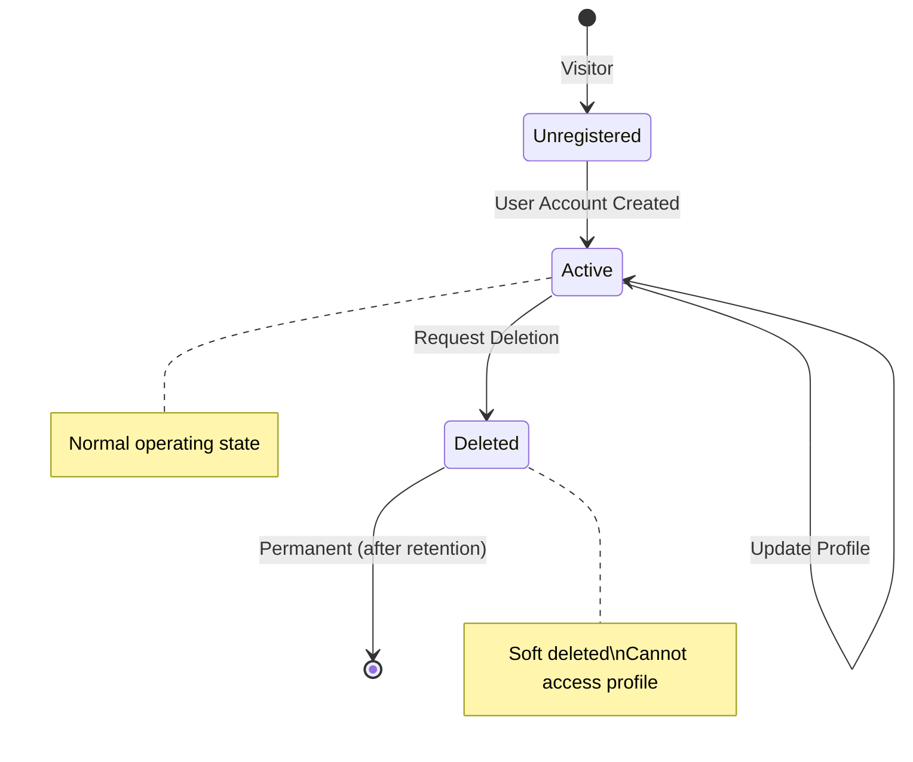

---

## 6. Component Interaction Diagram

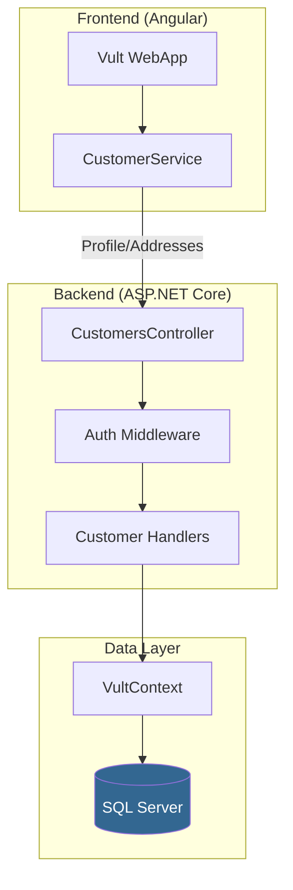

---

## 7. Data Flow Diagram

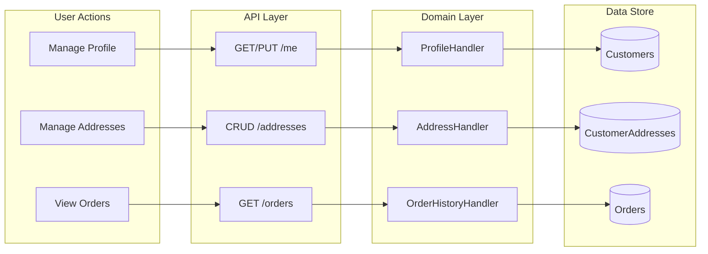

---

## 8. Entity Relationship Diagram

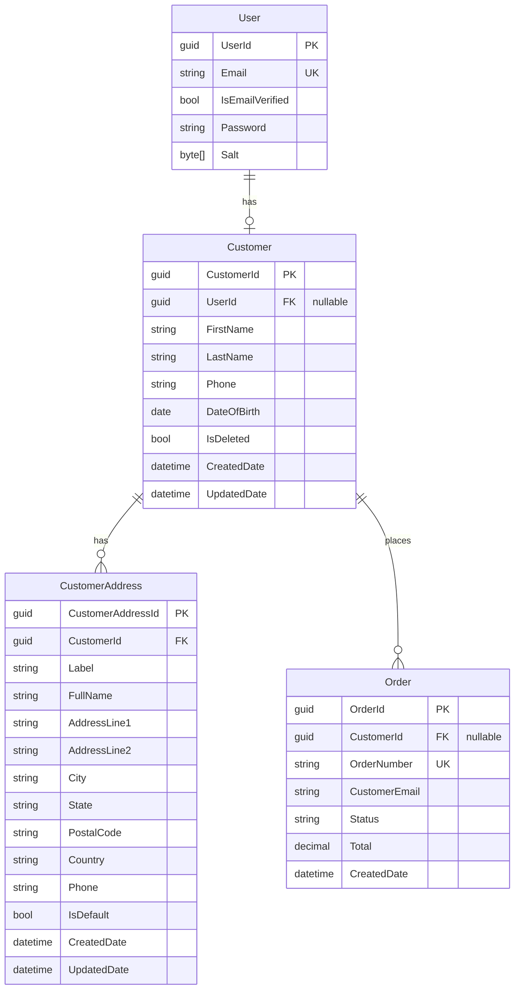

---

## 9. Customer Journey Diagram

### 9.1 Registered Customer Journey

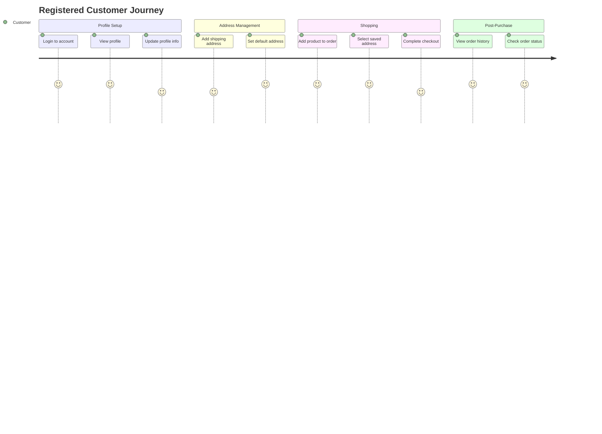

---

## 10. Error Handling Scenarios

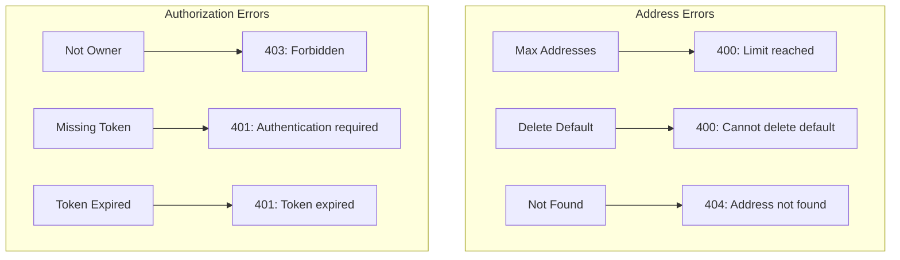

---

## 11. Integration Points with Order System

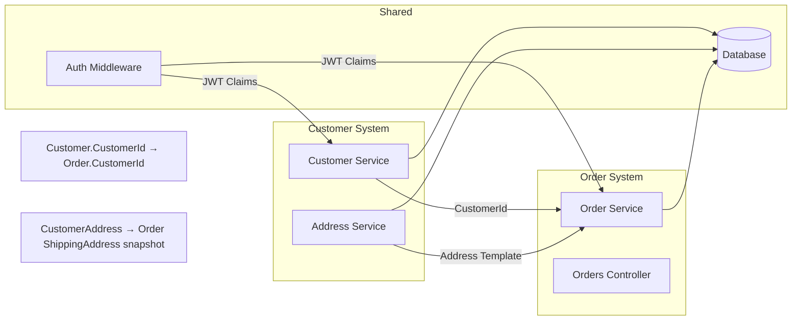

---

## 12. Summary of Use Cases

| ID | Use Case | Actor | Priority |
|----|----------|-------|----------|
| UC-001 | View Profile | Customer | High |
| UC-002 | Update Profile | Customer | High |
| UC-003 | Delete Account | Customer | Low |
| UC-004 | Add Address | Customer | High |
| UC-005 | Update Address | Customer | Medium |
| UC-006 | Delete Address | Customer | Medium |
| UC-007 | Set Default Address | Customer | Medium |
| UC-008 | View Order History | Customer | High |
| UC-009 | View Order Details | Customer | High |
