# Customer Management System - Use Case Diagrams

**Version:** 1.0
**Date:** December 2024
**Author:** Product Team

---

## 1. System Overview

### 1.1 Actors

| Actor | Description |
|-------|-------------|
| Visitor | Unauthenticated user browsing the site |
| Customer | Authenticated user with an account |
| System | Vult backend application |
| Email Service | External email provider (Phase 2) |

---

## 2. Use Case Diagrams

### 2.1 Customer Management Use Cases

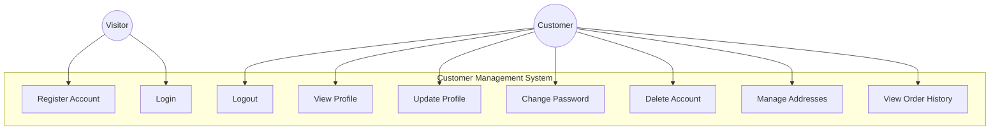
```mermaid
graph TB
    subgraph "Customer Management System"
        UC1[Register Account]
        UC2[Login]
        UC3[Logout]
        UC4[View Profile]
        UC5[Update Profile]
        UC6[Change Password]
        UC7[Delete Account]
        UC8[Manage Addresses]
        UC9[View Order History]
    end

    Visitor((Visitor))
    Customer((Customer))

    Visitor --> UC1
    Visitor --> UC2

    Customer --> UC3
    Customer --> UC4
    Customer --> UC5
    Customer --> UC6
    Customer --> UC7
    Customer --> UC8
    Customer --> UC9
```

### 2.2 Address Management Use Cases

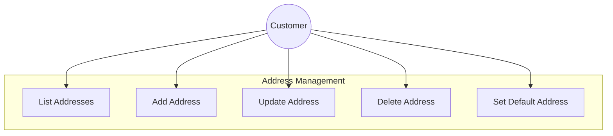
```mermaid
graph TB
    subgraph "Address Management"
        UC1[List Addresses]
        UC2[Add Address]
        UC3[Update Address]
        UC4[Delete Address]
        UC5[Set Default Address]
    end

    Customer((Customer))

    Customer --> UC1
    Customer --> UC2
    Customer --> UC3
    Customer --> UC4
    Customer --> UC5
```

---

## 3. Sequence Diagrams

### 3.1 Customer Registration Flow

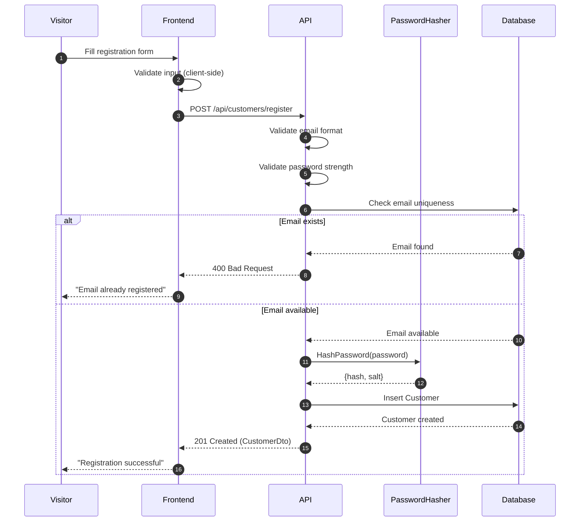
```mermaid
sequenceDiagram
    autonumber
    participant V as Visitor
    participant F as Frontend
    participant A as API
    participant H as PasswordHasher
    participant DB as Database

    V->>F: Fill registration form
    F->>F: Validate input (client-side)
    F->>A: POST /api/customers/register

    A->>A: Validate email format
    A->>A: Validate password strength
    A->>DB: Check email uniqueness

    alt Email exists
        DB-->>A: Email found
        A-->>F: 400 Bad Request
        F-->>V: "Email already registered"
    else Email available
        DB-->>A: Email available
        A->>H: HashPassword(password)
        H-->>A: {hash, salt}
        A->>DB: Insert Customer
        DB-->>A: Customer created
        A-->>F: 201 Created (CustomerDto)
        F-->>V: "Registration successful"
    end
```

### 3.2 Customer Login Flow

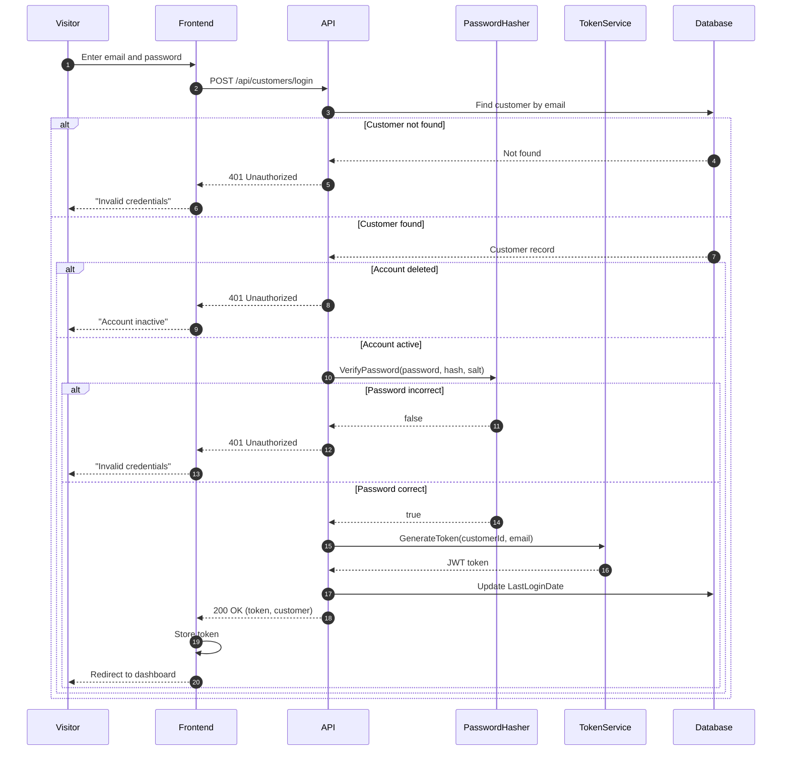
```mermaid
sequenceDiagram
    autonumber
    participant V as Visitor
    participant F as Frontend
    participant A as API
    participant H as PasswordHasher
    participant T as TokenService
    participant DB as Database

    V->>F: Enter email and password
    F->>A: POST /api/customers/login

    A->>DB: Find customer by email

    alt Customer not found
        DB-->>A: Not found
        A-->>F: 401 Unauthorized
        F-->>V: "Invalid credentials"
    else Customer found
        DB-->>A: Customer record

        alt Account deleted
            A-->>F: 401 Unauthorized
            F-->>V: "Account inactive"
        else Account active
            A->>H: VerifyPassword(password, hash, salt)

            alt Password incorrect
                H-->>A: false
                A-->>F: 401 Unauthorized
                F-->>V: "Invalid credentials"
            else Password correct
                H-->>A: true
                A->>T: GenerateToken(customerId, email)
                T-->>A: JWT token
                A->>DB: Update LastLoginDate
                A-->>F: 200 OK (token, customer)
                F->>F: Store token
                F-->>V: Redirect to dashboard
            end
        end
    end
```

### 3.3 Profile Update Flow

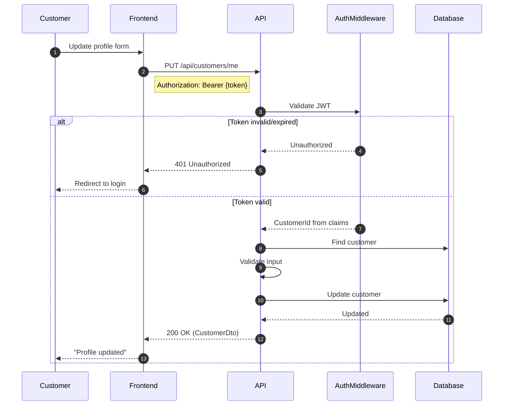
```mermaid
sequenceDiagram
    autonumber
    participant C as Customer
    participant F as Frontend
    participant A as API
    participant Auth as AuthMiddleware
    participant DB as Database

    C->>F: Update profile form
    F->>A: PUT /api/customers/me
    Note right of F: Authorization: Bearer {token}

    A->>Auth: Validate JWT

    alt Token invalid/expired
        Auth-->>A: Unauthorized
        A-->>F: 401 Unauthorized
        F-->>C: Redirect to login
    else Token valid
        Auth-->>A: CustomerId from claims
        A->>DB: Find customer
        A->>A: Validate input
        A->>DB: Update customer
        DB-->>A: Updated
        A-->>F: 200 OK (CustomerDto)
        F-->>C: "Profile updated"
    end
```

### 3.4 Address Management Flow

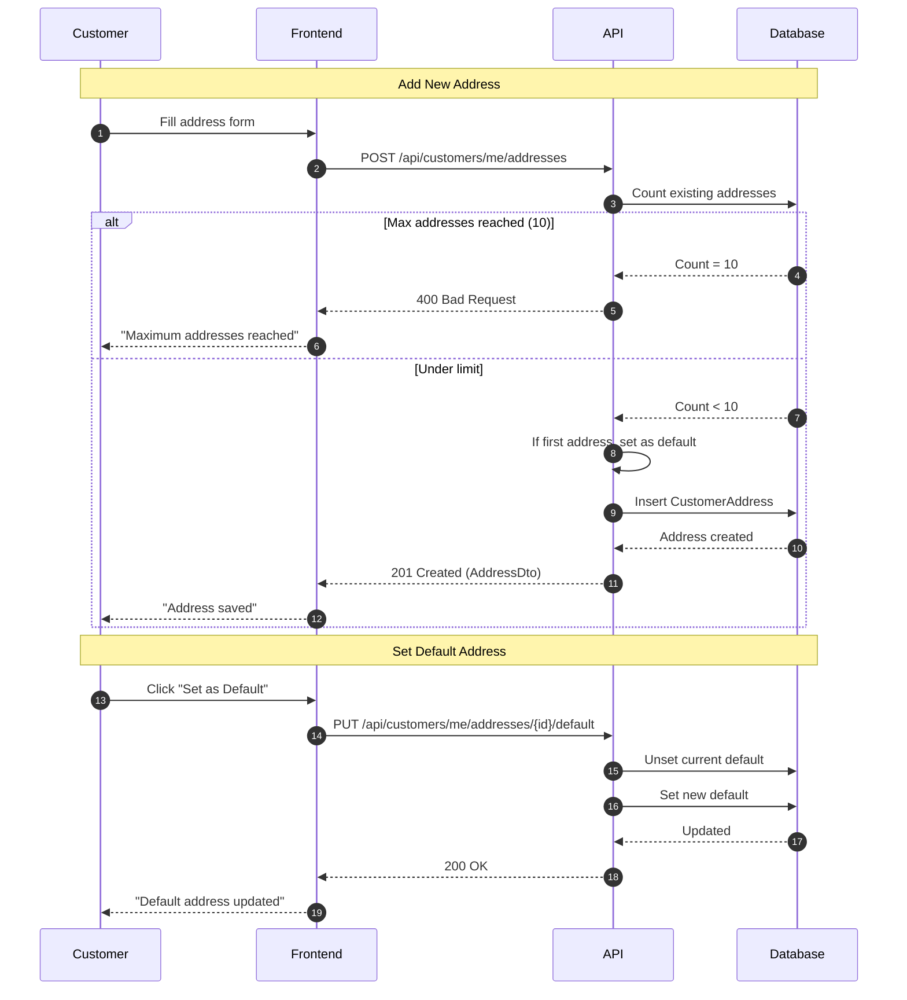
```mermaid
sequenceDiagram
    autonumber
    participant C as Customer
    participant F as Frontend
    participant A as API
    participant DB as Database

    Note over C,DB: Add New Address
    C->>F: Fill address form
    F->>A: POST /api/customers/me/addresses
    A->>DB: Count existing addresses

    alt Max addresses reached (10)
        DB-->>A: Count = 10
        A-->>F: 400 Bad Request
        F-->>C: "Maximum addresses reached"
    else Under limit
        DB-->>A: Count < 10
        A->>A: If first address, set as default
        A->>DB: Insert CustomerAddress
        DB-->>A: Address created
        A-->>F: 201 Created (AddressDto)
        F-->>C: "Address saved"
    end

    Note over C,DB: Set Default Address
    C->>F: Click "Set as Default"
    F->>A: PUT /api/customers/me/addresses/{id}/default
    A->>DB: Unset current default
    A->>DB: Set new default
    DB-->>A: Updated
    A-->>F: 200 OK
    F-->>C: "Default address updated"
```

### 3.5 Order History Flow

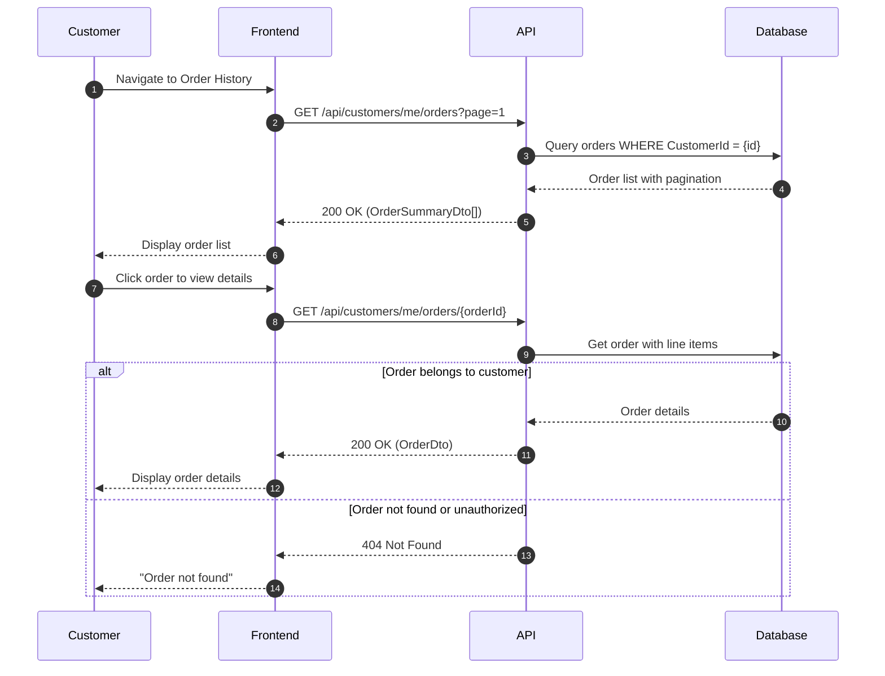
```mermaid
sequenceDiagram
    autonumber
    participant C as Customer
    participant F as Frontend
    participant A as API
    participant DB as Database

    C->>F: Navigate to Order History
    F->>A: GET /api/customers/me/orders?page=1
    A->>DB: Query orders WHERE CustomerId = {id}
    DB-->>A: Order list with pagination
    A-->>F: 200 OK (OrderSummaryDto[])
    F-->>C: Display order list

    C->>F: Click order to view details
    F->>A: GET /api/customers/me/orders/{orderId}
    A->>DB: Get order with line items

    alt Order belongs to customer
        DB-->>A: Order details
        A-->>F: 200 OK (OrderDto)
        F-->>C: Display order details
    else Order not found or unauthorized
        A-->>F: 404 Not Found
        F-->>C: "Order not found"
    end
```

---

## 4. Detailed Use Cases

### 4.1 UC-001: Register Account

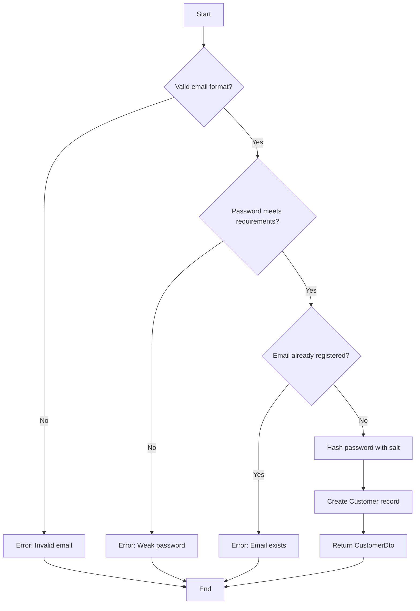
```mermaid
flowchart TD
    A[Start] --> B{Valid email format?}
    B -->|No| C[Error: Invalid email]
    B -->|Yes| D{Password meets requirements?}
    D -->|No| E[Error: Weak password]
    D -->|Yes| F{Email already registered?}
    F -->|Yes| G[Error: Email exists]
    F -->|No| H[Hash password with salt]
    H --> I[Create Customer record]
    I --> J[Return CustomerDto]
    J --> K[End]

    C --> K
    E --> K
    G --> K
```

**Use Case Specification:**

| Field | Value |
|-------|-------|
| **Name** | Register Account |
| **ID** | UC-001 |
| **Actors** | Visitor |
| **Preconditions** | - Visitor has valid email - Email not already registered |
| **Postconditions** | - Customer account created - Customer can login |
| **Basic Flow** | 1. Visitor provides email, password, name 2. System validates input 3. System checks email uniqueness 4. System hashes password 5. System creates customer 6. System returns success |
| **Alternative Flows** | - Duplicate email: Return error - Weak password: Return validation error |
| **Business Rules** | - Email must be unique - Password must meet policy |

---

### 4.2 UC-002: Login

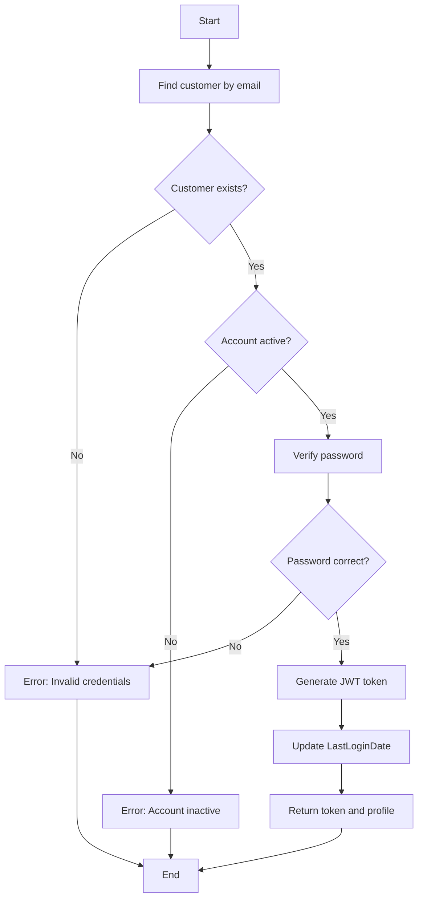
```mermaid
flowchart TD
    A[Start] --> B[Find customer by email]
    B --> C{Customer exists?}
    C -->|No| D[Error: Invalid credentials]
    C -->|Yes| E{Account active?}
    E -->|No| F[Error: Account inactive]
    E -->|Yes| G[Verify password]
    G --> H{Password correct?}
    H -->|No| D
    H -->|Yes| I[Generate JWT token]
    I --> J[Update LastLoginDate]
    J --> K[Return token and profile]
    K --> L[End]

    D --> L
    F --> L
```

**Use Case Specification:**

| Field | Value |
|-------|-------|
| **Name** | Login |
| **ID** | UC-002 |
| **Actors** | Visitor |
| **Preconditions** | - Customer account exists - Account not deleted |
| **Postconditions** | - Customer authenticated - JWT token issued |
| **Basic Flow** | 1. Visitor provides email and password 2. System finds customer by email 3. System verifies password 4. System generates JWT 5. System returns token |
| **Alternative Flows** | - Customer not found: Generic error - Wrong password: Generic error - Deleted account: Inactive error |
| **Business Rules** | - No email enumeration (same error for not found/wrong password) - Update last login timestamp |

---

### 4.3 UC-003: Manage Addresses

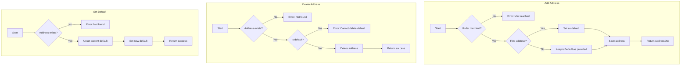
```mermaid
flowchart TD
    subgraph "Add Address"
        A1[Start] --> A2{Under max limit?}
        A2 -->|No| A3[Error: Max reached]
        A2 -->|Yes| A4{First address?}
        A4 -->|Yes| A5[Set as default]
        A4 -->|No| A6[Keep isDefault as provided]
        A5 --> A7[Save address]
        A6 --> A7
        A7 --> A8[Return AddressDto]
    end

    subgraph "Delete Address"
        D1[Start] --> D2{Address exists?}
        D2 -->|No| D3[Error: Not found]
        D2 -->|Yes| D4{Is default?}
        D4 -->|Yes| D5[Error: Cannot delete default]
        D4 -->|No| D6[Delete address]
        D6 --> D7[Return success]
    end

    subgraph "Set Default"
        S1[Start] --> S2{Address exists?}
        S2 -->|No| S3[Error: Not found]
        S2 -->|Yes| S4[Unset current default]
        S4 --> S5[Set new default]
        S5 --> S6[Return success]
    end
```

**Use Case Specification:**

| Field | Value |
|-------|-------|
| **Name** | Manage Addresses |
| **ID** | UC-003 |
| **Actors** | Customer |
| **Preconditions** | - Customer authenticated |
| **Postconditions** | - Address changes persisted |
| **Basic Flow (Add)** | 1. Customer provides address details 2. System validates address count 3. System sets default if first 4. System saves address |
| **Alternative Flows** | - Max addresses: Return error - Delete default: Return error |
| **Business Rules** | - Max 10 addresses per customer - First address is default - Cannot delete default address |

---

### 4.4 UC-004: View Order History

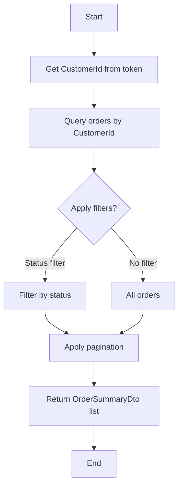
```mermaid
flowchart TD
    A[Start] --> B[Get CustomerId from token]
    B --> C[Query orders by CustomerId]
    C --> D{Apply filters?}
    D -->|Status filter| E[Filter by status]
    D -->|No filter| F[All orders]
    E --> G[Apply pagination]
    F --> G
    G --> H[Return OrderSummaryDto list]
    H --> I[End]
```

**Use Case Specification:**

| Field | Value |
|-------|-------|
| **Name** | View Order History |
| **ID** | UC-004 |
| **Actors** | Customer |
| **Preconditions** | - Customer authenticated |
| **Postconditions** | - Order list returned |
| **Basic Flow** | 1. Customer requests order history 2. System queries orders by CustomerId 3. System applies pagination 4. System returns order summaries |
| **Alternative Flows** | - No orders: Return empty list |
| **Business Rules** | - Only show customer's own orders - Default sort by date descending |

---

## 5. State Machine Diagrams

### 5.1 Customer Account State Machine

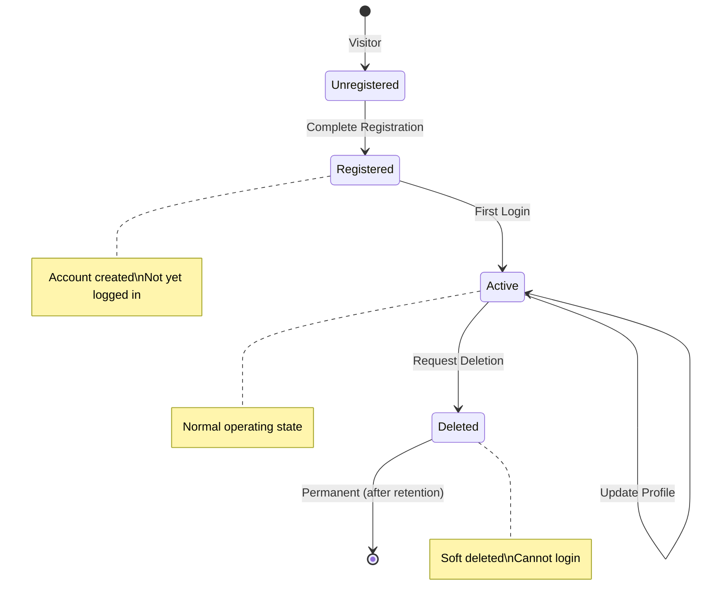
```mermaid
stateDiagram-v2
    [*] --> Unregistered: Visitor

    Unregistered --> Registered: Complete Registration
    Registered --> Active: First Login

    Active --> Active: Login/Logout
    Active --> Active: Update Profile
    Active --> Deleted: Request Deletion

    Deleted --> [*]: Permanent (after retention)

    note right of Registered: Account created\nNot yet logged in
    note right of Active: Normal operating state
    note right of Deleted: Soft deleted\nCannot login
```

### 5.2 Authentication Session State

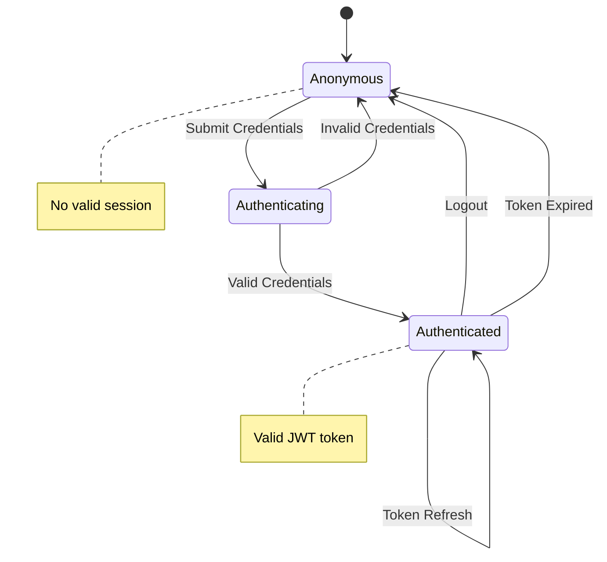
```mermaid
stateDiagram-v2
    [*] --> Anonymous

    Anonymous --> Authenticating: Submit Credentials
    Authenticating --> Authenticated: Valid Credentials
    Authenticating --> Anonymous: Invalid Credentials

    Authenticated --> Authenticated: Token Refresh
    Authenticated --> Anonymous: Logout
    Authenticated --> Anonymous: Token Expired

    note right of Anonymous: No valid session
    note right of Authenticated: Valid JWT token
```

---

## 6. Component Interaction Diagram

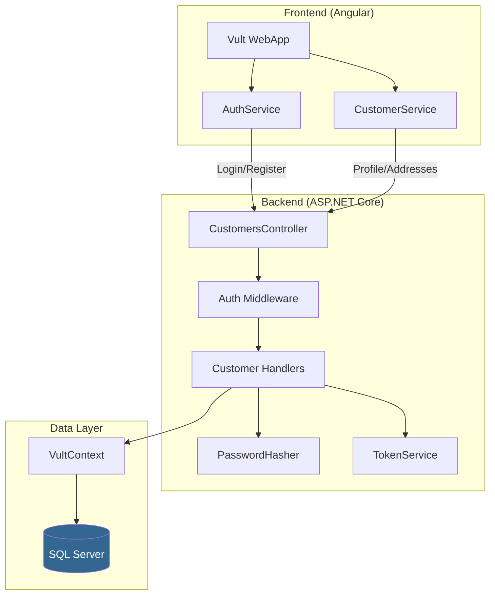
```mermaid
graph TB
    subgraph "Frontend (Angular)"
        FE[Vult WebApp]
        AS[AuthService]
        CS[CustomerService]
    end

    subgraph "Backend (ASP.NET Core)"
        CC[CustomersController]
        MW[Auth Middleware]
        CH[Customer Handlers]
        PH[PasswordHasher]
        TS[TokenService]
    end

    subgraph "Data Layer"
        DB[(SQL Server)]
        CTX[VultContext]
    end

    FE --> AS
    FE --> CS
    AS -->|Login/Register| CC
    CS -->|Profile/Addresses| CC

    CC --> MW
    MW --> CH
    CH --> PH
    CH --> TS
    CH --> CTX

    CTX --> DB

    style DB fill:#336791,color:#fff
```

---

## 7. Data Flow Diagram

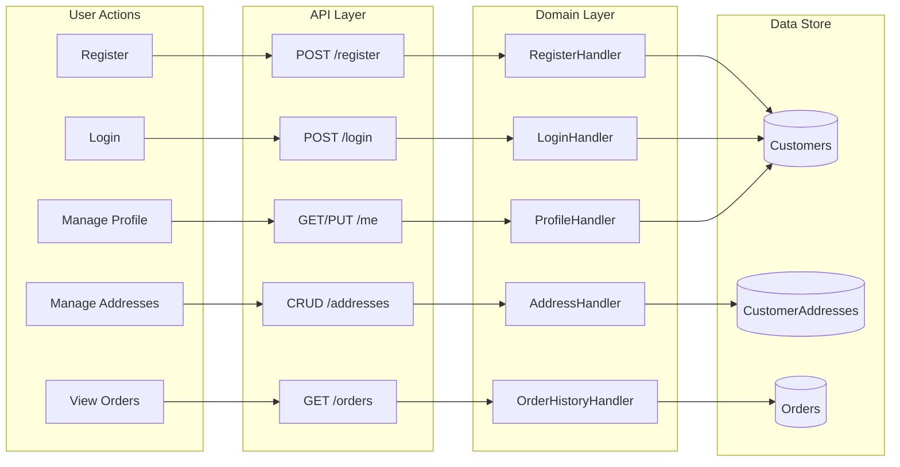
```mermaid
flowchart LR
    subgraph "User Actions"
        A1[Register]
        A2[Login]
        A3[Manage Profile]
        A4[Manage Addresses]
        A5[View Orders]
    end

    subgraph "API Layer"
        B1[POST /register]
        B2[POST /login]
        B3[GET/PUT /me]
        B4[CRUD /addresses]
        B5[GET /orders]
    end

    subgraph "Domain Layer"
        C1[RegisterHandler]
        C2[LoginHandler]
        C3[ProfileHandler]
        C4[AddressHandler]
        C5[OrderHistoryHandler]
    end

    subgraph "Data Store"
        D1[(Customers)]
        D2[(CustomerAddresses)]
        D3[(Orders)]
    end

    A1 --> B1 --> C1 --> D1
    A2 --> B2 --> C2 --> D1
    A3 --> B3 --> C3 --> D1
    A4 --> B4 --> C4 --> D2
    A5 --> B5 --> C5 --> D3
```

---

## 8. Entity Relationship Diagram

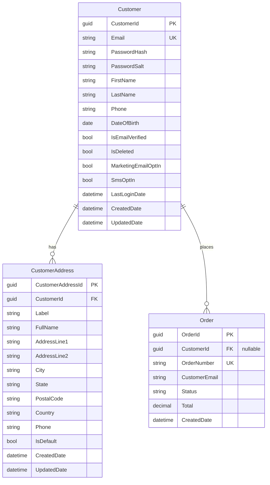
```mermaid
erDiagram
    Customer ||--o{ CustomerAddress : has
    Customer ||--o{ Order : places

    Customer {
        guid CustomerId PK
        string Email UK
        string PasswordHash
        string PasswordSalt
        string FirstName
        string LastName
        string Phone
        date DateOfBirth
        bool IsEmailVerified
        bool IsDeleted
        bool MarketingEmailOptIn
        bool SmsOptIn
        datetime LastLoginDate
        datetime CreatedDate
        datetime UpdatedDate
    }

    CustomerAddress {
        guid CustomerAddressId PK
        guid CustomerId FK
        string Label
        string FullName
        string AddressLine1
        string AddressLine2
        string City
        string State
        string PostalCode
        string Country
        string Phone
        bool IsDefault
        datetime CreatedDate
        datetime UpdatedDate
    }

    Order {
        guid OrderId PK
        guid CustomerId FK "nullable"
        string OrderNumber UK
        string CustomerEmail
        string Status
        decimal Total
        datetime CreatedDate
    }
```

---

## 9. Customer Journey Diagram

### 9.1 New Customer Journey

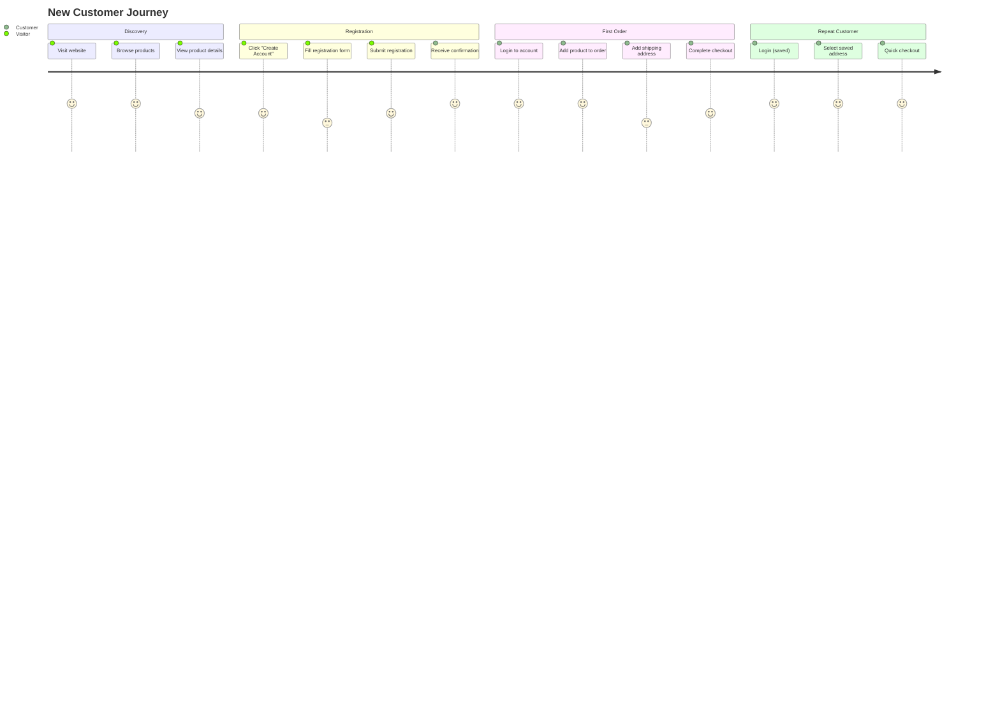
```mermaid
journey
    title New Customer Journey
    section Discovery
      Visit website: 5: Visitor
      Browse products: 5: Visitor
      View product details: 4: Visitor
    section Registration
      Click "Create Account": 4: Visitor
      Fill registration form: 3: Visitor
      Submit registration: 4: Visitor
      Receive confirmation: 5: Customer
    section First Order
      Login to account: 5: Customer
      Add product to order: 5: Customer
      Add shipping address: 3: Customer
      Complete checkout: 4: Customer
    section Repeat Customer
      Login (saved): 5: Customer
      Select saved address: 5: Customer
      Quick checkout: 5: Customer
```

### 9.2 Checkout Integration Journey

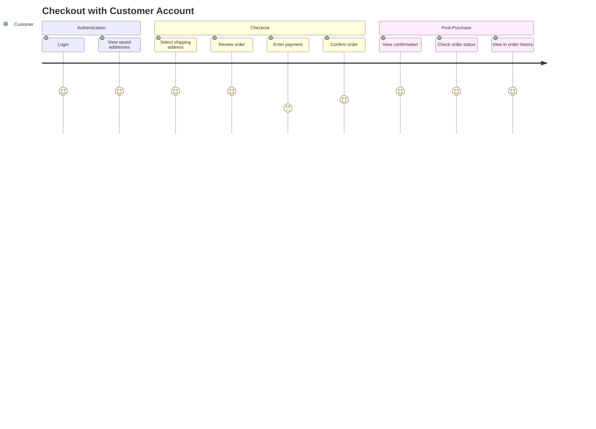
```mermaid
journey
    title Checkout with Customer Account
    section Authentication
      Login: 5: Customer
      View saved addresses: 5: Customer
    section Checkout
      Select shipping address: 5: Customer
      Review order: 5: Customer
      Enter payment: 3: Customer
      Confirm order: 4: Customer
    section Post-Purchase
      View confirmation: 5: Customer
      Check order status: 5: Customer
      View in order history: 5: Customer
```

---

## 10. Security Flow Diagrams

### 10.1 Authentication Flow

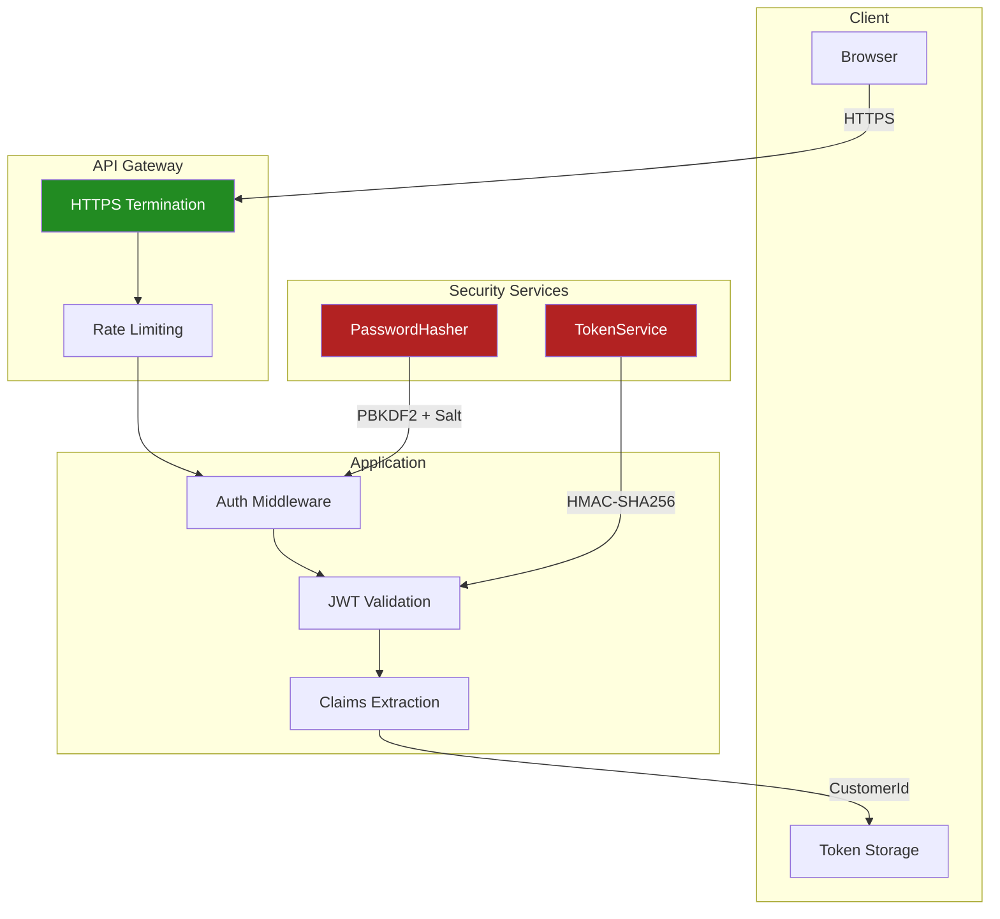
```mermaid
flowchart TB
    subgraph "Client"
        C1[Browser]
        C2[Token Storage]
    end

    subgraph "API Gateway"
        G1[HTTPS Termination]
        G2[Rate Limiting]
    end

    subgraph "Application"
        A1[Auth Middleware]
        A2[JWT Validation]
        A3[Claims Extraction]
    end

    subgraph "Security Services"
        S1[PasswordHasher]
        S2[TokenService]
    end

    C1 -->|HTTPS| G1
    G1 --> G2
    G2 --> A1
    A1 --> A2
    A2 --> A3
    A3 -->|CustomerId| C2

    S1 -->|PBKDF2 + Salt| A1
    S2 -->|HMAC-SHA256| A2

    style G1 fill:#228B22,color:#fff
    style S1 fill:#B22222,color:#fff
    style S2 fill:#B22222,color:#fff
```

### 10.2 Password Security Flow

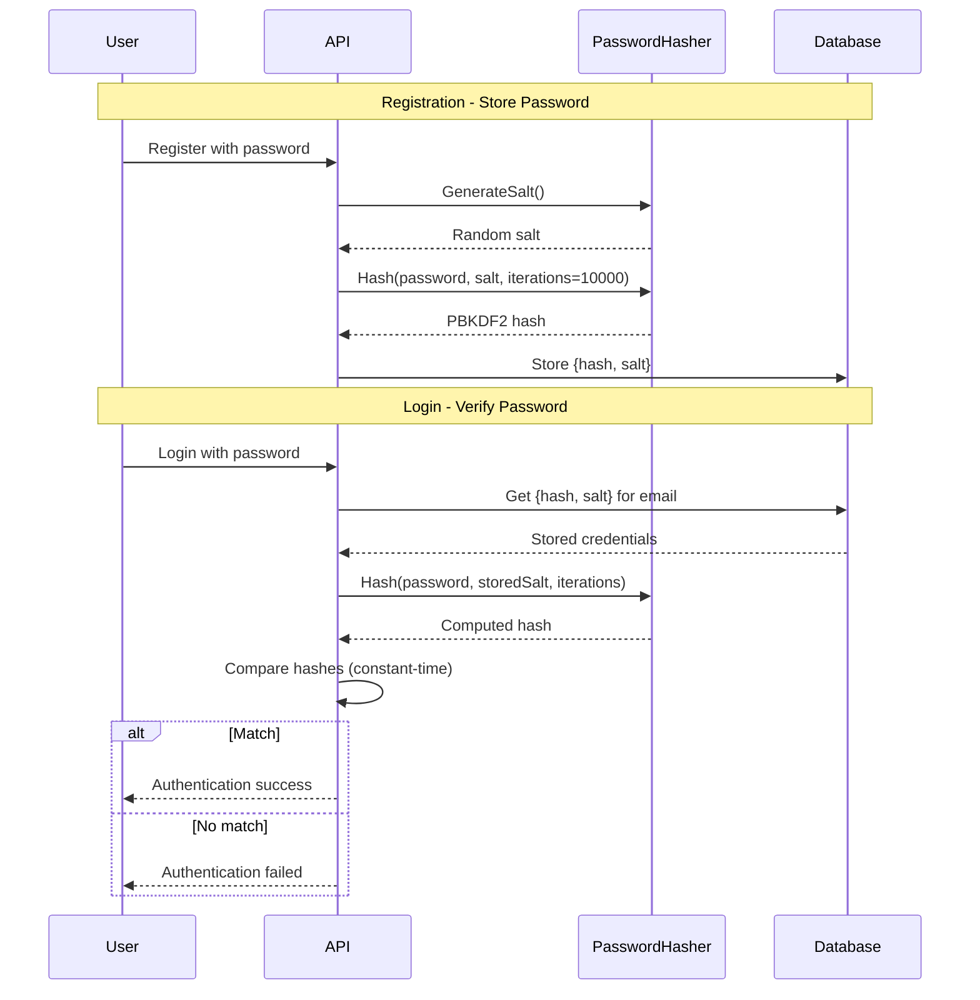
```mermaid
sequenceDiagram
    participant U as User
    participant A as API
    participant H as PasswordHasher
    participant DB as Database

    Note over U,DB: Registration - Store Password
    U->>A: Register with password
    A->>H: GenerateSalt()
    H-->>A: Random salt
    A->>H: Hash(password, salt, iterations=10000)
    H-->>A: PBKDF2 hash
    A->>DB: Store {hash, salt}

    Note over U,DB: Login - Verify Password
    U->>A: Login with password
    A->>DB: Get {hash, salt} for email
    DB-->>A: Stored credentials
    A->>H: Hash(password, storedSalt, iterations)
    H-->>A: Computed hash
    A->>A: Compare hashes (constant-time)

    alt Match
        A-->>U: Authentication success
    else No match
        A-->>U: Authentication failed
    end
```

---

## 11. Error Handling Scenarios

```mermaid
flowchart TD
    subgraph "Registration Errors"
        RE1[Invalid Email Format] --> RE1A[400: Validation error]
        RE2[Duplicate Email] --> RE2A[409: Email already exists]
        RE3[Weak Password] --> RE3A[400: Password requirements]
    end

    subgraph "Authentication Errors"
        AE1[Invalid Credentials] --> AE1A[401: Generic message]
        AE2[Account Deleted] --> AE2A[401: Account inactive]
        AE3[Token Expired] --> AE3A[401: Token expired]
        AE4[Token Invalid] --> AE4A[401: Invalid token]
    end

    subgraph "Address Errors"
        AD1[Max Addresses] --> AD1A[400: Limit reached]
        AD2[Delete Default] --> AD2A[400: Cannot delete default]
        AD3[Not Found] --> AD3A[404: Address not found]
    end

    subgraph "Authorization Errors"
        AU1[Not Owner] --> AU1A[403: Forbidden]
        AU2[Missing Token] --> AU2A[401: Authentication required]
    end
```

---

## 12. Integration Points with Order System

```mermaid
flowchart LR
    subgraph "Customer System"
        CS[Customer Service]
        AS[Address Service]
    end

    subgraph "Order System"
        OS[Order Service]
        OC[Orders Controller]
    end

    subgraph "Shared"
        DB[(Database)]
        Auth[Auth Middleware]
    end

    CS -->|CustomerId| OS
    AS -->|Address Template| OS
    Auth -->|JWT Claims| CS
    Auth -->|JWT Claims| OS

    CS --> DB
    AS --> DB
    OS --> DB

    Note1[Customer.CustomerId → Order.CustomerId]
    Note2[CustomerAddress → Order ShippingAddress snapshot]
```

---

## 13. Summary of Use Cases

| ID | Use Case | Actor | Priority |
|----|----------|-------|----------|
| UC-001 | Register Account | Visitor | High |
| UC-002 | Login | Visitor | High |
| UC-003 | Logout | Customer | High |
| UC-004 | View Profile | Customer | High |
| UC-005 | Update Profile | Customer | High |
| UC-006 | Change Password | Customer | Medium |
| UC-007 | Delete Account | Customer | Low |
| UC-008 | Add Address | Customer | High |
| UC-009 | Update Address | Customer | Medium |
| UC-010 | Delete Address | Customer | Medium |
| UC-011 | Set Default Address | Customer | Medium |
| UC-012 | View Order History | Customer | High |
| UC-013 | View Order Details | Customer | High |
