# Order and Payment System - Use Case Diagrams

**Version:** 1.0
**Date:** December 2024
**Author:** Product Team

---

## 1. System Overview

### 1.1 Actors

| Actor | Description |
|-------|-------------|
| Customer | End user placing orders and making payments |
| System | Vult backend application |
| Stripe | External payment processor |
| Admin | System administrator (future phase) |

---

## 2. Use Case Diagrams

### 2.1 Order Management Use Cases

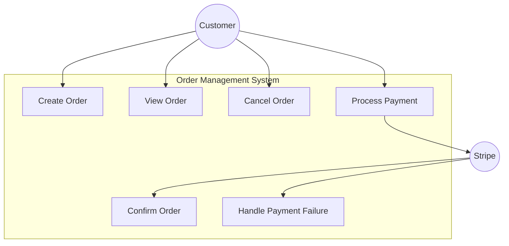

### 2.2 Complete Order Flow Use Case

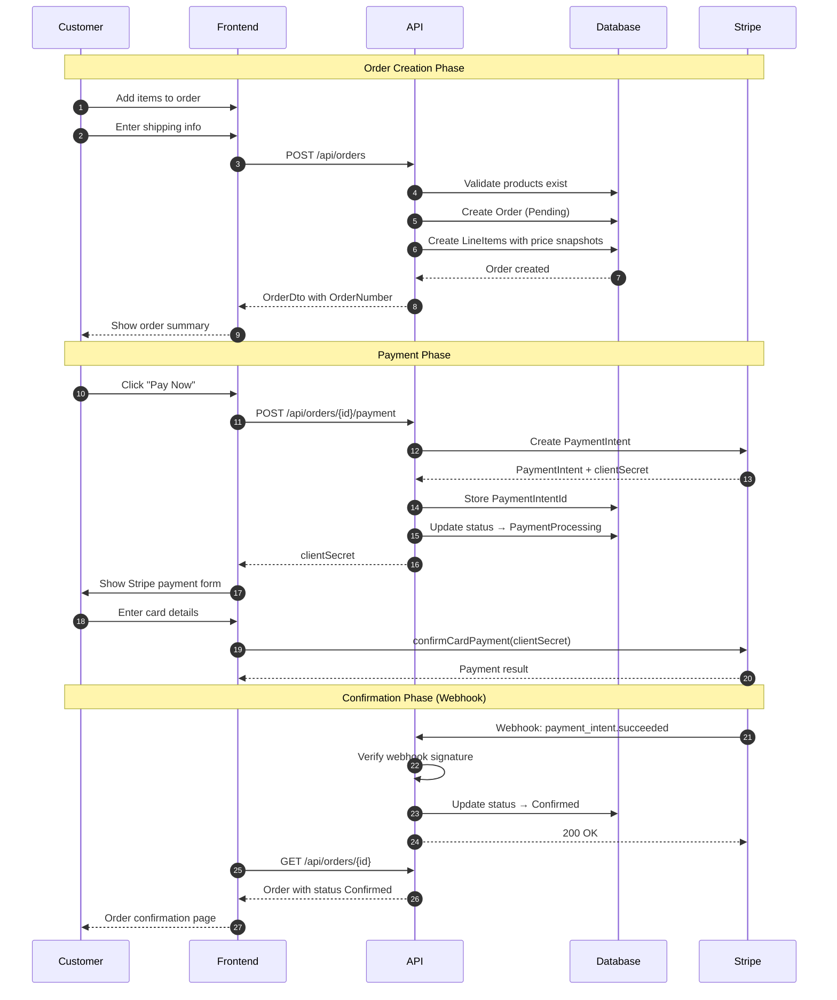

---

## 3. Detailed Use Cases

### 3.1 UC-001: Create Order

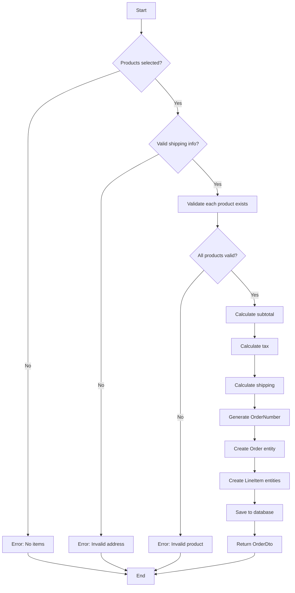

**Use Case Specification:**

| Field | Value |
|-------|-------|
| **Name** | Create Order |
| **ID** | UC-001 |
| **Actors** | Customer |
| **Preconditions** | - At least one valid product selected - Shipping information provided |
| **Postconditions** | - Order created with status "Pending" - Unique order number generated - Line items created with price snapshots |
| **Basic Flow** | 1. Customer provides shipping information 2. Customer provides list of products with quantities 3. System validates all products exist 4. System calculates order totals 5. System creates order with line items 6. System returns order details |
| **Alternative Flows** | - Product not found: Return error with invalid ProductId - Invalid quantity: Return validation error |
| **Business Rules** | - Minimum 1 line item per order - Quantity must be ≥ 1 - Price snapshot captured at order time |

---

### 3.2 UC-002: Process Payment

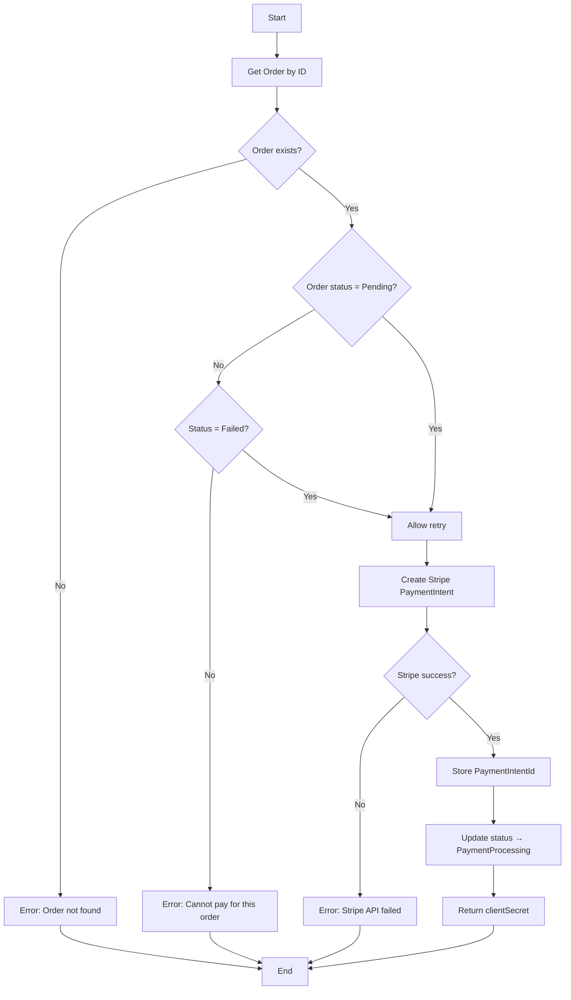

**Use Case Specification:**

| Field | Value |
|-------|-------|
| **Name** | Process Payment |
| **ID** | UC-002 |
| **Actors** | Customer, Stripe |
| **Preconditions** | - Order exists - Order status is Pending or Failed |
| **Postconditions** | - PaymentIntent created in Stripe - Order status updated to PaymentProcessing - Client secret returned |
| **Basic Flow** | 1. Customer requests to pay for order 2. System validates order is payable 3. System creates PaymentIntent via Stripe API 4. System stores PaymentIntentId 5. System returns client secret to frontend |
| **Alternative Flows** | - Order not found: Return 404 - Order already paid: Return 400 - Stripe API error: Return 500 |
| **Business Rules** | - Only Pending or Failed orders can be paid - Amount sent to Stripe in cents |

---

### 3.3 UC-003: Handle Stripe Webhook

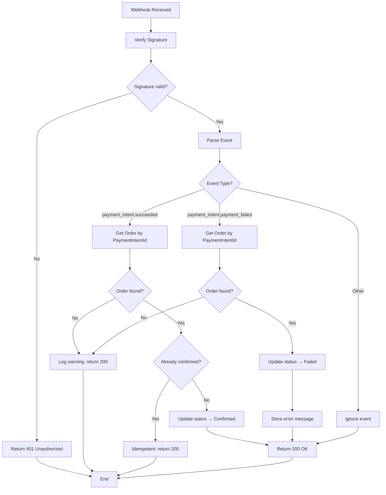

**Use Case Specification:**

| Field | Value |
|-------|-------|
| **Name** | Handle Stripe Webhook |
| **ID** | UC-003 |
| **Actors** | Stripe |
| **Preconditions** | - Webhook endpoint configured in Stripe - Webhook signing secret configured |
| **Postconditions** | - Order status updated based on payment result |
| **Basic Flow** | 1. Stripe sends webhook event 2. System verifies webhook signature 3. System parses event type 4. System finds order by PaymentIntentId 5. System updates order status accordingly |
| **Alternative Flows** | - Invalid signature: Return 401 - Order not found: Log and return 200 - Duplicate webhook: Idempotent handling |
| **Business Rules** | - Always return 200 for valid webhooks (even if order not found) - Handle duplicates idempotently |

---

### 3.4 UC-004: Cancel Order

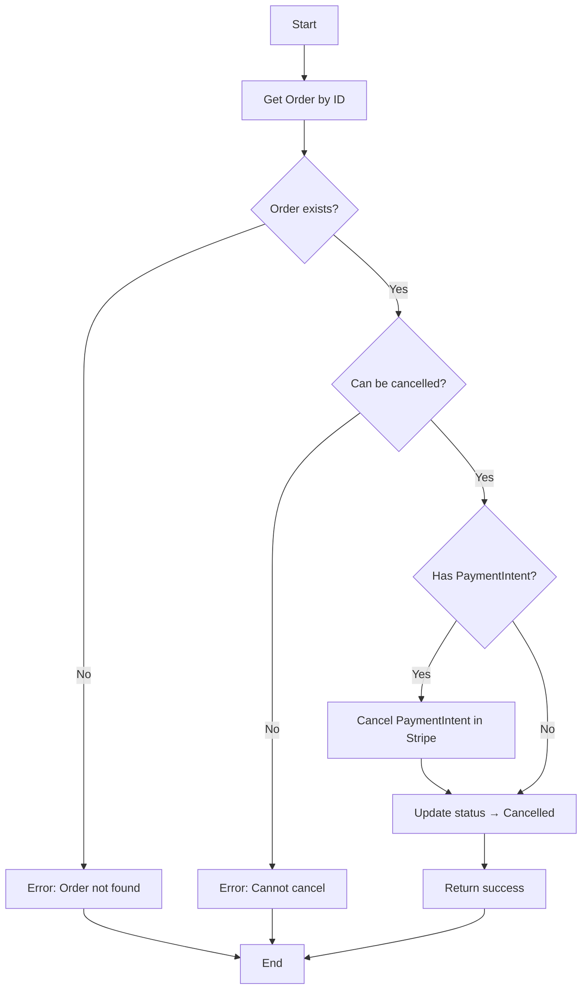

**Use Case Specification:**

| Field | Value |
|-------|-------|
| **Name** | Cancel Order |
| **ID** | UC-004 |
| **Actors** | Customer |
| **Preconditions** | - Order exists - Order not already confirmed/shipped |
| **Postconditions** | - Order status set to Cancelled - PaymentIntent cancelled (if exists) |
| **Basic Flow** | 1. Customer requests cancellation 2. System validates order can be cancelled 3. System cancels Stripe PaymentIntent if exists 4. System updates status to Cancelled |
| **Alternative Flows** | - Order confirmed: Cannot cancel - Order already cancelled: Return success (idempotent) |
| **Business Rules** | - Only Pending, PaymentProcessing, or Failed orders can be cancelled |

---

## 4. State Machine Diagram

### 4.1 Order Status State Machine

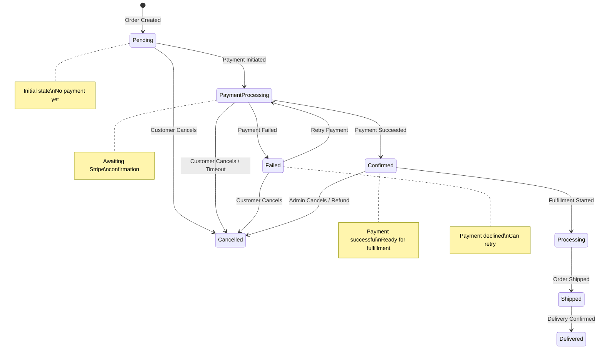

### 4.2 Valid State Transitions

| From Status | To Status | Trigger |
|-------------|-----------|---------|
| - | Pending | Order created |
| Pending | PaymentProcessing | Payment intent created |
| Pending | Cancelled | Customer cancellation |
| PaymentProcessing | Confirmed | Stripe webhook (succeeded) |
| PaymentProcessing | Failed | Stripe webhook (failed) |
| PaymentProcessing | Cancelled | Timeout or cancellation |
| Failed | PaymentProcessing | Payment retry |
| Failed | Cancelled | Customer cancellation |
| Confirmed | Processing | Fulfillment started |
| Confirmed | Cancelled | Refund/admin action |
| Processing | Shipped | Order shipped |
| Shipped | Delivered | Delivery confirmed |

---

## 5. Component Interaction Diagram

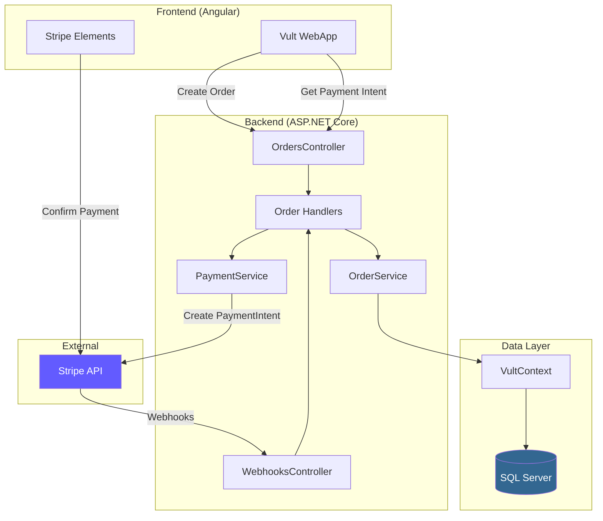

---

## 6. Data Flow Diagram

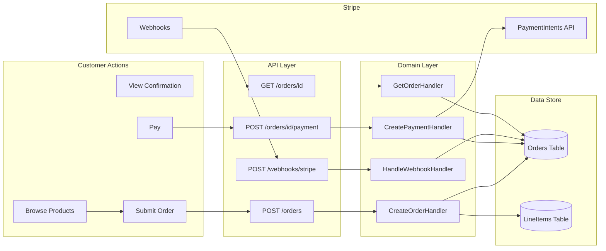

---

## 7. Entity Relationship Diagram

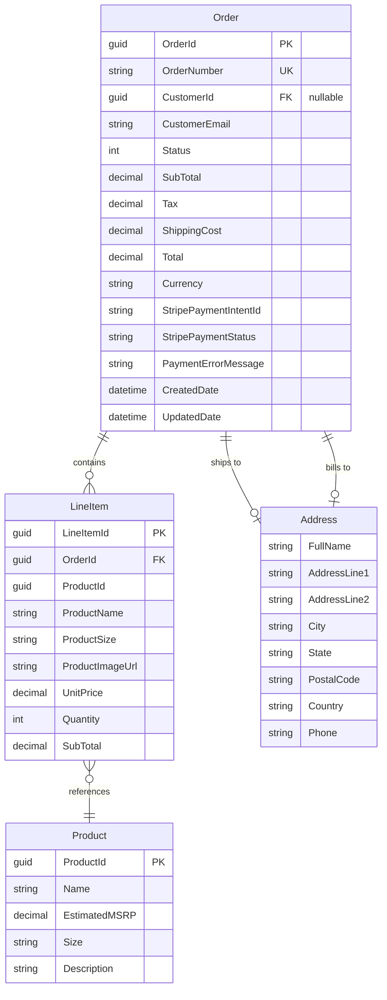

---

## 8. Checkout Journey Diagram (Nike.com Reference)

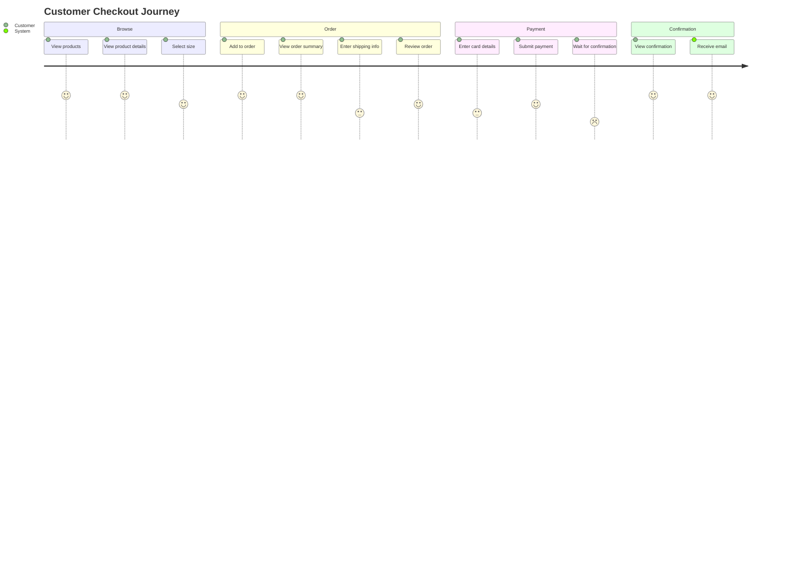

---

## 9. API Sequence Diagrams

### 9.1 Complete Checkout Sequence

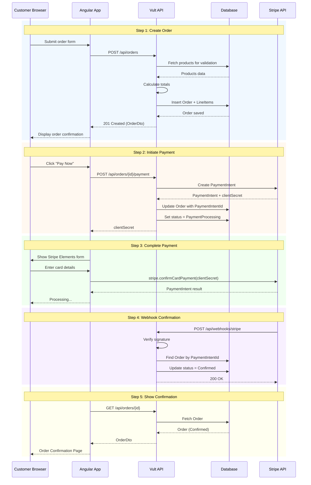

---

## 10. Error Handling Scenarios

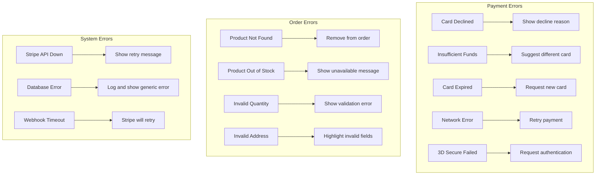

---

## 11. Security Considerations Diagram

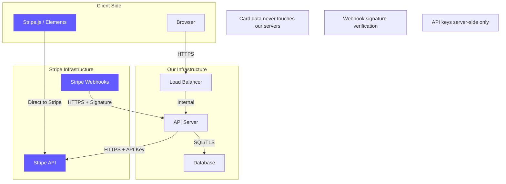

---

## 12. Summary of Use Cases

| ID | Use Case | Actor | Priority |
|----|----------|-------|----------|
| UC-001 | Create Order | Customer | High |
| UC-002 | Process Payment | Customer, Stripe | High |
| UC-003 | Handle Stripe Webhook | Stripe | High |
| UC-004 | Cancel Order | Customer | Medium |
| UC-005 | View Order | Customer | High |
| UC-006 | Retry Failed Payment | Customer | Medium |
| UC-007 | Get Order by Number | Customer | Medium |
